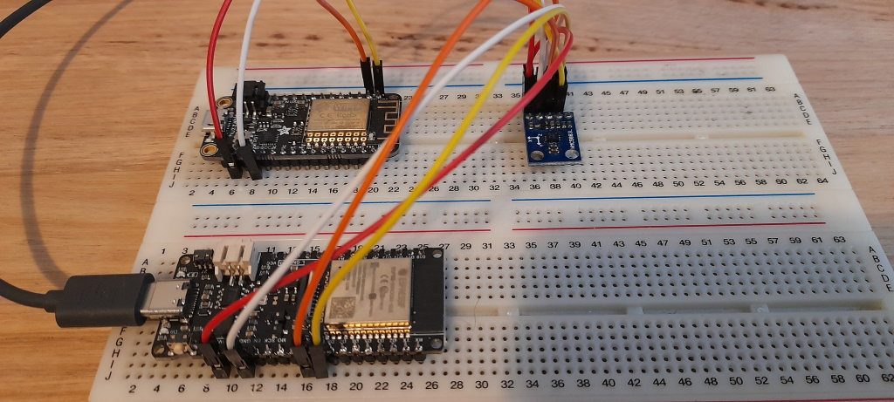

# ESP32 Axis Prediction Using TFLite #

This example shows a working example of the ESP32 using tensorflow lite to predict yaw, pitch and roll movements.

### Hardware Used ###
* FireBeetle 2 ESP32-E
* HMC5883L Compass



### Instructions ###

* Gather your IMU training data and save to a csv file. imu.csv contains data formatted from a previous project. 
* I prefer to load my environment using docker: ```docker run --gpus all -it --rm -v <this folder>:/tmp tensorflow/tensorflow:latest-gpu bash```
* Run the training script: ```python3 train.py```
* Convert the model to a byte array with:<br />
```echo "const unsigned char model[] = {" > model.h```<br />
```cat movement_model.tflite | xxd -i >> model.h```<br />
```echo "};" >> model.h```
* Include the generated model.h in to the sketch folder then compile and upload.

### Result ###
Output confusion matrix showing actual vs predicted test


### References ###
* https://github.com/arduino/ArduinoTensorFlowLiteTutorials/blob/master/GestureToEmoji/arduino_tinyml_workshop.ipynb
* https://docs.arduino.cc/tutorials/nano-33-ble-sense/get-started-with-machine-learning